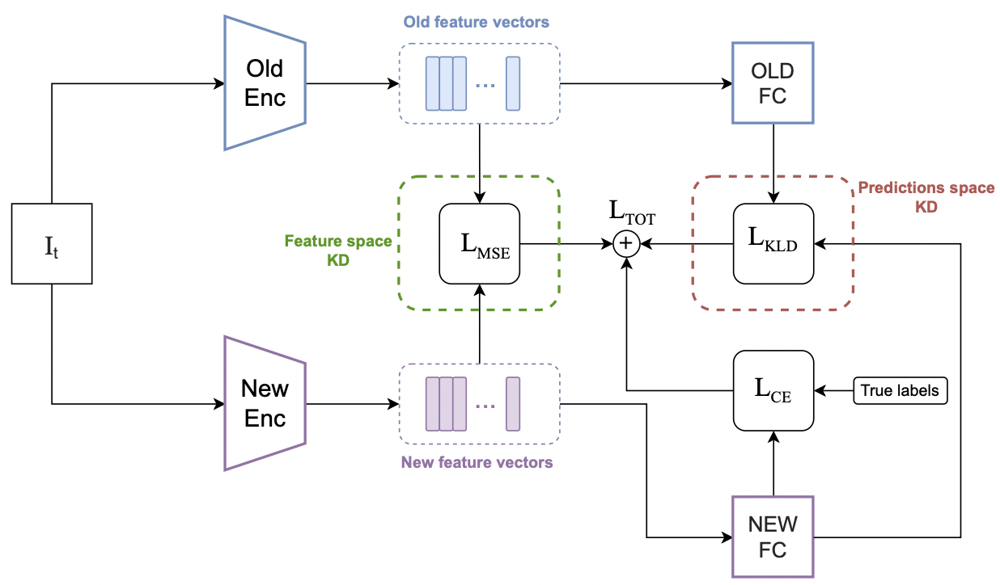

# Exploring the Joint Use of Rehearsal and Knowledge Distillation in Continual Learning for Spoken Language Understanding
This codebase contains the implementation of the experiments on the efficacy of combining rehearsal and knowledge distillation (KD) techniques applied to a Class-Incremental Continual Learning (CiCL) scenario for the Spoken Language Understanding task. This is the official code implementation of the homologous paper accepted at INTERSPEECH 2023.

## General overview

We explore a CiCL scenario for SLU, specifically for Intent Classification. The dataset used for the experiments is Fluent Speech Commands [[1]](#1). We consider multiple KD combinations at different levels in the network (i.e., feature and predictions space), applied to only rehearsal data or their combination with the current task data. The experimental results support the effectiveness of concurrently exerting predictions space and feature space KDs. Additionally, our method is expecially suitable for low-resource devices in that it attains larger gains for smaller rehearsal buffer's sizes.



## Environment setup
The requested libraries for running the experiments are listed in the requirements.txt file. Run the command below to install them.  
**N.B.**: for the experiments the forked continuum library must be used (https://github.com/umbertocappellazzo/continuum.git).  

```
pip install -r requirements.txt
```

I used weights and biases (https://wandb.ai/site) for tracking my experiments (I warmly recommend it). Nonetheless, you can deactivate it by adding `--use_wandb` in the command line.

## Running an experiment
If you want to run the experiments using iCaRL [[2]](#2), random, or closest_to_mean as rehearsal strategy, you need to use `main.py`. For GEM [[3]](#3), use `main_GEM.py`.  

The standard CiCL scenario encompasses 10 tasks overall, each of them comprising 3 intents/classes (except the first task that has 4 intents). For the first run remember to add `--download_dataset` if you want to download the FSC dataset. 


An experiment is defined by whether the KD is applied or not, either in the feature space or in the predictions space. Plus, you need to decide whether to use only the rehearsal data or their combination with the data from the current task. You can choose the desired experiment by setting the value for `feat_space_kd` and `preds_space_kd`. Each parameter can take three values: `'None'`, `'only_rehe'`, and `'all'`. For all the other parameters (training, TCN enc, etc.), please refer to the code and/or paper.  


Suppose we want to run an experiment using iCaRL as rehearsal strategy with buffer size equal to 930, and we apply the KD in the feature space to only the rehearsal samples, whereas the KD in the predictions space uses both current and rehe data. Then the command to run is: 

```
python main.py --data_path MY_PATH_TO_DATASET --memory_size 930 --herding barycenter --feat_space_kd only_rehe --preds_space_kd all 
```

If you'd like to run the offline baseline (i.e., no CL --> 1 single task with all 31 intents):

```
python main.py --data_path MY_PATH_TO_DATASET --offline_train 
```

## References
<a id="1">[1]</a> 
L. Lugosch, M. Ravanelli, P. Ignoto, V. S. Tomar, and Y. Bengio, *"Speech model pre-training for end-to-end spoken language understanding"*, Interspeech 2019, 2019.

<a id="2">[2]</a>
Z. Li and D. Hoiem, *"Learning without forgetting”*, IEEE transactions on pattern analysis and machine intelligence, 2017.

<a id="3">[3]</a>
D.Lopez-Paz and M.Ranzato, *“Gradient episodic memory for continual learning”*, NeurIPS, 2017.
